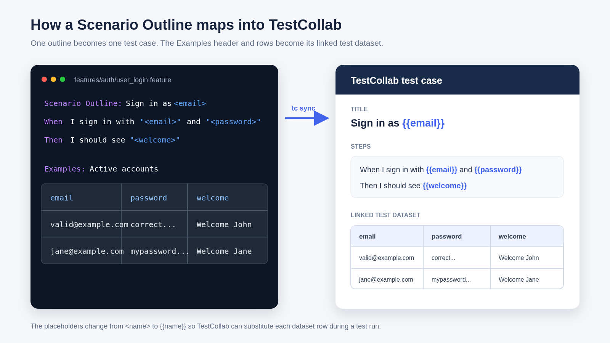

# TestCollab BDD sync and report demo

This repository is a complete example of one BDD workflow:

1. `tc sync` maps committed `.feature` files to TestCollab suites, test cases, and datasets.
2. Cucumber runs the same scenarios and writes a JUnit report.
3. `tc report` maps the JUnit results back to those synced cases without IDs in the feature files.

Fork the repository, replace the project ID and API token, and run the workflow. The demo uses the official `@testcollab/cli` package and a small browser-like DOM, so no test server or browser download is required.

## What this sample covers

- Feature and scenario tags
- Feature and Rule backgrounds
- `Rule:` sections
- Scenario Outlines and multiple Examples rows
- TestCollab test datasets and `{{parameter}}` substitution
- Step Data Tables
- Doc Strings with line breaks
- Cucumber JUnit output
- Title-based result mapping from Cucumber to BDD-synced cases
- Local and GitHub Actions workflows

## From Gherkin to a TestCollab dataset



The important mapping is:

| In the `.feature` file | In TestCollab |
|---|---|
| Feature title | BDD-managed test suite |
| Scenario or Scenario Outline | BDD-managed test case |
| `Scenario Outline: Sign in as <email>` | Test case title `Sign in as {{email}}` |
| `<email>` in a title or step | Dataset reference `{{email}}` |
| Examples header | Dataset columns |
| Examples rows | Dataset rows |
| Step Data Table | Table displayed inside that step |
| Doc String | Preformatted text displayed inside that step |
| Directory path | Parent suite hierarchy |

A Scenario Outline creates one TestCollab case, not one case per Examples row. Its Examples table becomes the linked dataset. When Cucumber expands the outline into several JUnit results, `tc report` rolls those rows back into the same TestCollab execution.

This is the suite tree created by the original version of this sample:


## Quick start

### 1. Fork and install

Use Node.js 20 or newer.

```bash
git clone https://github.com/YOUR_ACCOUNT/testcollab-bdd-demo-v2.git
cd testcollab-bdd-demo-v2
npm ci
```

### 2. Create a TestCollab project

Create or select a project on [TestCollab](https://testcollab.com). Copy the number from the project URL.


Scenario Outline datasets require an Elite or Enterprise plan. On another plan, the scenarios still sync, but the CLI prints a warning and does not create their linked datasets.

### 3. Create an API token

Open your profile menu, select **My profile settings**, open **API token**, and generate a token.


The token owner needs permission to create suites, test cases, datasets, tags, test plans, and assignments. An Administrator or Lead role is the simplest choice for this demo.

### 4. Add local configuration

```bash
cp .env.example .env
```

Edit `.env`:

```dotenv
TC_PROJECT_ID=1234
TESTCOLLAB_TOKEN=your_api_token
```

Do not commit `.env`. It is ignored by Git.

### 5. Run the complete flow

```bash
npm run tc:demo
```

That command runs these steps in order:

```bash
npm run tc:sync
npm run test:bdd
npm run test:junit
npm run tc:report
```

The result is:

- Two feature suites under the `Account` and `Auth` directory suites.
- Four BDD-managed test cases in TestCollab. The two outlines expand to six Cucumber executions, then roll back into their two cases.
- Two linked datasets built from the Examples tables.
- One CI test plan containing the synced cases.
- Passed execution results reported from `reports/cucumber-junit.xml`.

## Why `tc report` finds the synced cases

Cucumber writes the feature title to JUnit `classname` and the scenario title to `name`:

```xml
<testcase
  classname="User profile management"
  name="Update profile from a Gherkin data table" />
```

`tc sync` stored those same titles as a suite and a case. `tc report` uses the pair to resolve the case. You do not need `[TC-123]` markers in the feature file.

Scenario Outline rows have longer generated names. The CLI understands Cucumber's Rule, outline, Examples, row-number, and expanded-title format. `npm run test:junit` calls the CLI's real BDD matcher against all six generated results. The command fails if a reporter change would stop the results from matching.

Keep these rules in mind:

- Run `tc sync` for the same commit before `tc report`.
- Keep feature titles unique in the TestCollab project.
- Commit feature changes before syncing. `tc sync` ignores uncommitted changes.
- Let Git own BDD-managed cases and datasets. Edit the `.feature` file, then sync again.
- Avoid changing a feature title and reporting results before that rename has synced.

## Explore the advanced Gherkin examples

### Scenario Outlines and datasets

[`features/auth/user_login.feature`](features/auth/user_login.feature) contains two Rule sections and two Scenario Outlines. Each Examples table becomes a linked TestCollab dataset. Parameters are converted from `<email>` to `{{email}}` in the synced title and steps.

### Step Data Tables and Doc Strings

[`features/account/profile_management.feature`](features/account/profile_management.feature) contains a step Data Table and a multiline Doc String. These stay inside the step content. They do not become TestCollab datasets. Only a Scenario Outline's Examples table creates a dataset.

### The test implementation

[`features/step_definitions/demo.steps.js`](features/step_definitions/demo.steps.js) drives the real page in `index.html` through JSDOM. [`features/support/world.js`](features/support/world.js) gives every scenario a fresh application and session.

## Run commands separately

Run only the tests and create JUnit:

```bash
npm run test:bdd
```

Sync committed feature changes:

```bash
npm run tc:sync
```

Report an existing JUnit file after sync:

```bash
npm run tc:report
```

Use the EU region by adding this to `.env`:

```dotenv
TC_API_URL=https://api-eu.testcollab.io
```

## GitHub Actions

The workflow at [`.github/workflows/bdd.yml`](.github/workflows/bdd.yml) always runs the Cucumber suite on pushes and pull requests. It also syncs and reports on non-pull-request runs when these repository settings exist:

- Actions variable `TC_PROJECT_ID`
- Actions secret `TESTCOLLAB_TOKEN`

The checkout uses full Git history because `tc sync` calculates changes from Git commits. Forks without TestCollab credentials still run the tests and upload the JUnit report; they skip sync and report.

## CLI package source

The dependency name is `@testcollab/cli`. This repository pins the official BDD enhancement commit so the sync-to-report title matching shown here is present and reproducible. After that release is published to npm, the dependency can be changed to its released version without changing any command.

## Troubleshooting

### `TC_PROJECT_ID is required`

Copy `.env.example` to `.env` and replace both placeholders. You can also export `TC_PROJECT_ID` and `TESTCOLLAB_TOKEN` in your shell.

### The CLI reports no feature changes

Commit the `.feature` files first:

```bash
git add features
git commit -m "Update BDD scenarios"
npm run tc:sync
```

### A Scenario Outline has no linked dataset

Check that the project plan includes test datasets and that the `test_datasets` feature is available. The sync output includes a warning when this feature is unavailable.

### Results are unmatched

Run `npm run tc:sync` before `npm run tc:report`. Then run `npm run test:junit`. It verifies the exact feature and scenario identities consumed by the CLI.

### Use a local or private TestCollab API

Set `TC_API_URL` in `.env`, for example:

```dotenv
TC_API_URL=http://localhost:1337
```

## Support

- [TestCollab CLI](https://github.com/TCSoftInc/testcollab-cli)
- [TestCollab](https://testcollab.com)
- support@testcollab.com
